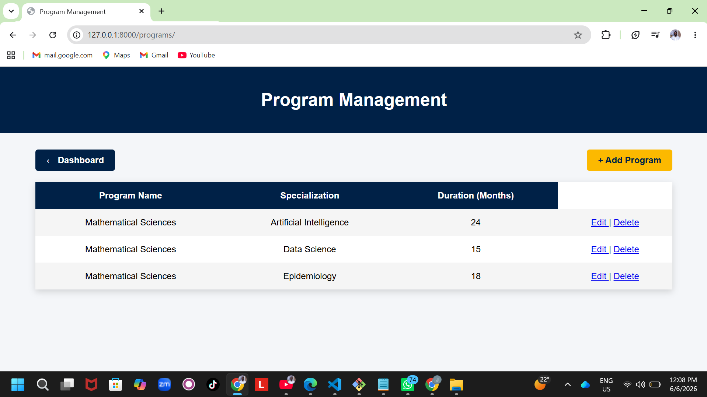
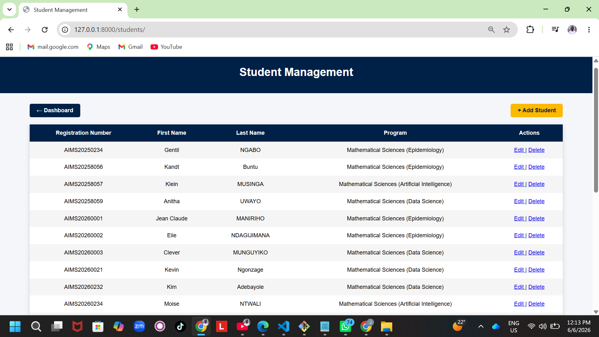
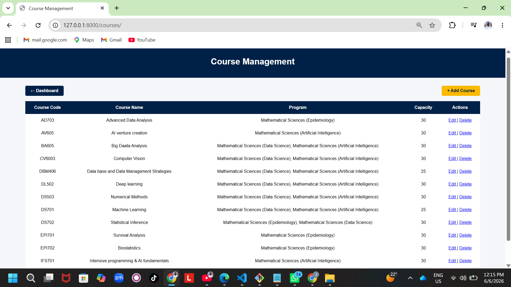
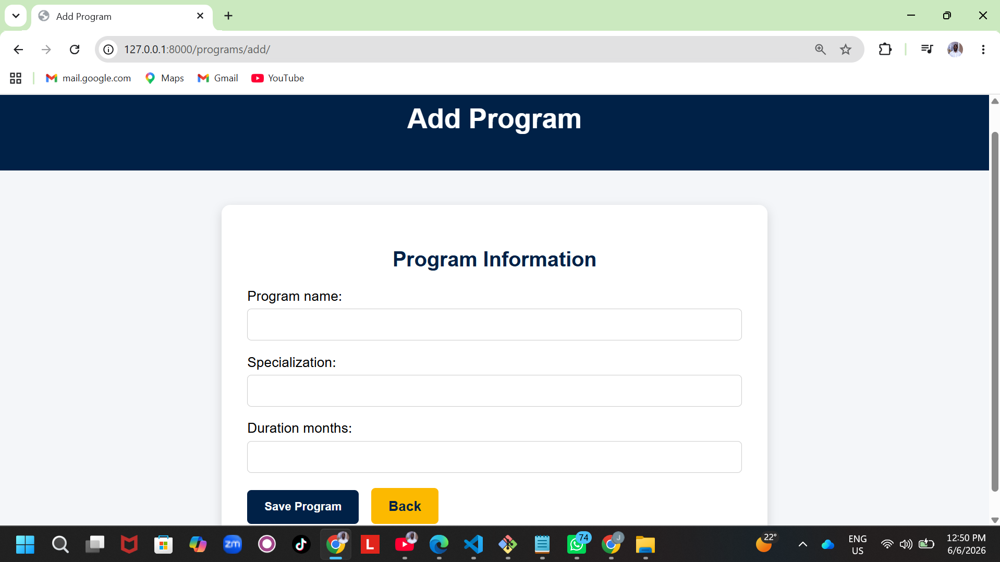
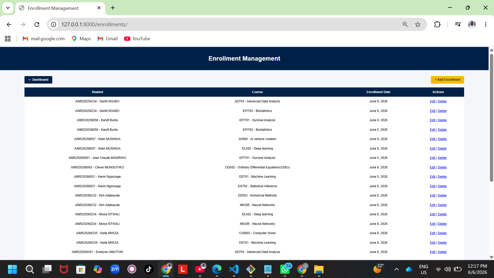
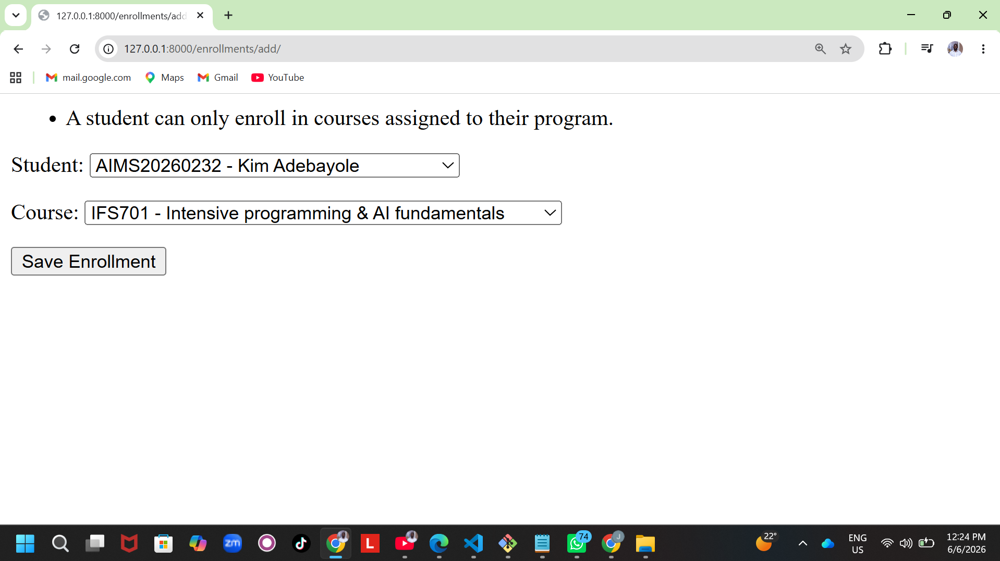
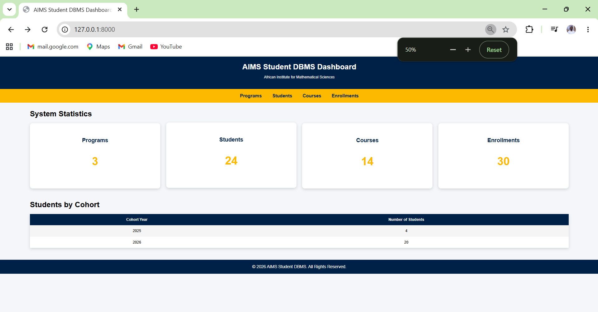

# AIMS Student Database Management System (AIMS Student DBMS)

A comprehensive web-based Student Database Management System developed using
**Python**, **Django**, **SQLite**, **HTML**, and **CSS** to support academic
program administration, student management, course management, and enrollment
operations within a university environment.

The system was designed with a strong focus on **data integrity**,
**business rule enforcement**, **relational database design**, and
**user-friendly management interfaces**.

---

## Project Overview

Managing academic records manually can lead to data inconsistencies,
duplicate registrations, invalid enrollments, and difficulties in tracking
student progress.

The AIMS Student DBMS addresses these challenges by providing a centralized
platform for:

- Academic Program Management
- Student Registration Management
- Course Administration
- Enrollment Processing
- Capacity Management
- Academic Data Validation
- Cohort Tracking and Analytics

The system implements real-world university registration rules to ensure
accuracy and consistency of academic records.

---

## Key Features

### Program Management

- Create academic programs
- Update program information
- Delete programs safely
- View all available programs
- Support multiple specializations



---

### Student Management

- Add students
- Update student information
- Delete student records
- View student lists
- Automatic registration number validation
- Cohort year extraction

Example registration format:

```text
AIMS20260001
```

Features:

- Unique registration numbers
- Program assignment
- Cohort identification
- Data validation



---

### Course Management

- Create courses
- Update courses
- Delete courses
- Assign courses to multiple programs
- Capacity management
- Course code validation

Example course codes:

```text
DS701
AI701
EPI701
STAT701
```

Features:

- Multi-program course assignment
- Capacity control
- Course code validation
- Academic program integration



---

### Multi-Program Course Support

A single course can be assigned to multiple academic programs.

Example:

```text
Machine Learning

✓ Data Science
✓ Artificial Intelligence
✓ Applied Mathematics
```

This design reflects real university structures where several programs
share common courses.



---

### Enrollment Management

- Create enrollments
- Update enrollments
- Delete enrollments
- View enrollment records
- Automatic enrollment date generation

Features:

- Program validation
- Duplicate enrollment prevention
- Capacity enforcement
- Data integrity protection



---

## Advanced Business Rules

The system enforces several real-world academic policies.



### Registration Number Validation

Accepted:

```text
AIMS20260001
```

Rejected:

```text
AIMS12345
ABC20260001
AIMS20263
```

---

### Program-Based Enrollment Validation

Students can only enroll in courses assigned to their academic program.

Example:

```text
Student Program:
Data Science

Course:
Machine Learning

Assigned Programs:
✓ Data Science
✓ Artificial Intelligence
✓ Applied Mathematics
```

Result:

```text
Enrollment Allowed
```

---

### Duplicate Enrollment Prevention

A student cannot be enrolled in the same course more than once.

Example:

```text
Student A
Course DS701
```

Duplicate enrollment attempts are automatically rejected.

---

### Capacity Management

Each course has a maximum enrollment capacity.

Example:

```text
Capacity = 40
```

Once capacity is reached:

```text
Additional enrollments are rejected.
```

---

## Dashboard

The application includes a custom dashboard that provides:

- Total Programs
- Total Students
- Total Courses
- Total Enrollments
- Student Cohort Statistics
- Quick Navigation



---

## System Architecture

```text
Programs
    │
    ▼
Students
    │
    ▼
Enrollments
    ▲
    │
Courses
```

Relationships:

- One Program → Many Students
- One Course → Many Programs
- One Student → Many Enrollments
- One Course → Many Enrollments

---

## Technologies Used

### Backend

- Python
- Django

### Database

- SQLite

### Frontend

- HTML
- CSS

### Version Control

- Git
- GitHub

---

## Database Concepts Demonstrated

This project demonstrates practical implementation of:

- Relational Database Design
- Primary Keys
- Foreign Keys
- Many-to-Many Relationships
- Data Validation
- Constraint Enforcement
- CRUD Operations
- Business Logic Implementation

---

## Project Achievements

Successfully implemented:

- Custom Django Dashboard
- Program CRUD Module
- Student CRUD Module
- Course CRUD Module
- Enrollment CRUD Module
- Multi-Program Course Assignment
- Capacity Validation
- Duplicate Enrollment Prevention
- Registration Validation
- Enrollment Validation
- Cohort Tracking

---

## Future Enhancements

Planned improvements include:

- Search Functionality
- Advanced Filtering
- PDF Report Generation
- Excel Export
- Interactive Analytics Dashboard
- Authentication and Authorization
- Email Notifications
- Cloud Deployment

---

## Author

**Jean Claude Maniriho**

Mastercard Foundation Scholar at AIMS Rwanda pursuing a Master's degree in
Mathematical Sciences (Epidemiology), with a strong academic foundation in
Mathematical Statistics from the University of Rwanda.

I am a Full-Stack Developer, Data Scientist, and Researcher passionate about
applying mathematics, statistics, software engineering, and machine learning
to solve real-world problems in public health, education, and
decision-making systems.

Currently involved in research on the effects of climate change indicators
on the spatial distribution of malaria infections among school children in
Kenya, in collaboration with AIMS Rwanda and KEMRI.

---

### Technical Skills

- Python
- Django
- SQL & Database Design
- SQLite & PostgreSQL
- HTML, CSS, JavaScript
- Git & GitHub
- R Programming
- MATLAB
- Statistical Modeling
- Machine Learning
- Survival Analysis
- Spatial Data Analysis

---

### Areas of Interest

- Epidemiology
- Data Science
- Artificial Intelligence
- Software Development
- Public Health Analytics
- Climate and Health Research
- Database Systems
- Decision Science

---

### Connect with Me

- GitHub: [github.com/Claude-2Rachande](https://github.com/Claude-2Rachande)
- LinkedIn: [jean-claude-maniriho](https://www.linkedin.com/in/jean-claude-maniriho-3a308929b)

---

### Vision

My goal is to develop innovative data-driven and technology-based solutions
that contribute to improving healthcare systems, education, and
evidence-based decision-making across Africa.
---

## License

MIT License

Copyright (c) 2026 Jean Claude Maniriho

Permission is hereby granted, free of charge, to any person obtaining a copy
of this software and associated documentation files (the "Software"), to deal
in the Software without restriction, including without limitation the rights
to use, copy, modify, merge, publish, distribute, sublicense, and/or sell
copies of the Software, and to permit persons to whom the Software is
furnished to do so, subject to the following conditions:

The above copyright notice and this permission notice shall be included in
all copies or substantial portions of the Software.

THE SOFTWARE IS PROVIDED "AS IS", WITHOUT WARRANTY OF ANY KIND, EXPRESS OR
IMPLIED, INCLUDING BUT NOT LIMITED TO THE WARRANTIES OF MERCHANTABILITY,
FITNESS FOR A PARTICULAR PURPOSE AND NONINFRINGEMENT. IN NO EVENT SHALL THE
AUTHORS OR COPYRIGHT HOLDERS BE LIABLE FOR ANY CLAIM, DAMAGES OR OTHER
LIABILITY, WHETHER IN AN ACTION OF CONTRACT, TORT OR OTHERWISE, ARISING FROM,
OUT OF OR IN CONNECTION WITH THE SOFTWARE OR THE USE OR OTHER DEALINGS IN
THE SOFTWARE.
